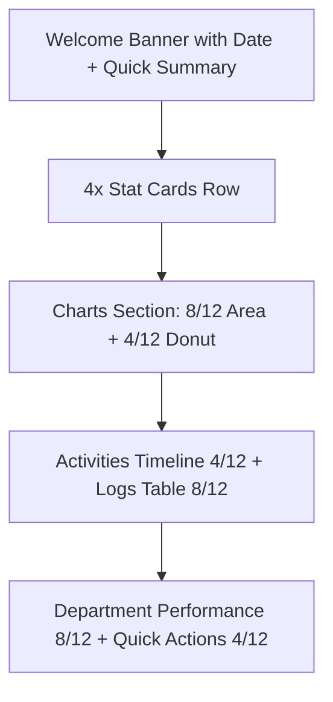

# Dashboard Redesign Plan — "Lector V2"

## Current State Analysis

The current dashboard ([`page.tsx`](src/app/(admin)/dashboard/page.tsx)) has:

- **ROW 1**: Area Chart (8 cols) + Donut/Pie Chart (4 cols)
- **ROW 2**: 4x Stat Cards (equal width)
- **ROW 3**: Recent Activities (4 cols) + Operational Logs Table (8 cols)

### Issues with Current Design

1. **No Welcome/Hero section** — users land on charts immediately without context
2. **Stat cards are below the charts** — key metrics should be visible first (above the fold)
3. **Static hardcoded data** in Activities and Logs — not connected to real Firestore data
4. **Donut chart labeled "Traffic"** — misleading for an attendance app
5. **Area chart only shows 1 line** (present) — should show present + late + absent for comparison
6. **No department performance visualization** — data exists in [`useDashboardStats`](src/hooks/useDashboardStats.ts:37) but unused
7. **No quick action shortcuts** — dashboard should enable quick navigation

---

## New Layout Structure



### Row-by-Row Breakdown

---

### 🔹 ROW 0 — Welcome Hero Banner (NEW)

A full-width banner card with:

- **Greeting** based on time of day — "Good Morning, Admin ☀️"
- **Today's date** formatted nicely
- **3 inline mini-stats**: Total Employees, Attendance Rate %, Pending Leaves
- Subtle gradient background using brand color `--lector-sidebar-brand`
- Animated entrance with framer-motion

---

### 🔹 ROW 1 — Stat Cards (MOVED UP from ROW 2)

4 cards in a grid, each with:

- **Colored left accent border** instead of icon in corner
- **Title** (uppercase, muted)
- **Big number** with optional unit
- **Trend indicator** with percentage change (up/down arrow)
- **Micro progress bar** at the bottom showing ratio vs total
- **Hover**: subtle scale + glow effect

Cards:

1. Hadir Hari Ini → `presentToday` / `totalEmployees` — emerald accent
2. Terlambat → `lateToday` — amber accent
3. Total Jam Kerja → `totalWorkingHours` hrs — purple accent
4. Departemen Aktif → `activeDepartmentsCount` — blue accent

---

### 🔹 ROW 2 — Charts Section (ENHANCED)

**Left (8 cols) — Multi-line Area Chart:**

- Show 3 areas: Present (emerald), Late (amber), Absent (red)
- Custom tooltip with clean styling
- Animated gradient fills
- Period selector tabs: Daily / Weekly / Monthly

**Right (4 cols) — Enhanced Donut:**

- Rename "Traffic" → "Distribusi Kehadiran" (Attendance Distribution)
- Center: attendance rate % with ring animation
- Below donut: 3 legend items with percentage + color dot
- Clean minimal design

---

### 🔹 ROW 3 — Activities + Logs (ENHANCED)

**Left (5 cols) — Recent Activities Timeline:**

- Vertical timeline with colored dots and connector lines
- Each item: avatar initial, user name, action, relative time
- Subtle fade-in stagger animation
- "View All" link at bottom

**Right (7 cols) — Operational Logs Table:**

- Sticky header with subtle background
- Status badges with dot indicators (not just text)
- Row hover with subtle highlight
- Pagination info at bottom
- "View All History" button

---

### 🔹 ROW 4 — Department Performance + Quick Actions (NEW)

**Left (8 cols) — Department Performance:**

- Horizontal bar chart or progress bars showing department attendance rates
- Data from [`departmentDistribution`](src/hooks/useDashboardStats.ts:37)
- Color-coded bars with percentage labels
- Sorted by highest attendance

**Right (4 cols) — Quick Actions:**

- Grid of 4 action buttons:

1. "Lihat Absensi" → `/attendance`
2. "Kelola Karyawan" → `/employees`
3. "Laporan" → `/reports`
4. "Pengaturan" → `/settings`

- Each with icon, label, and subtle hover effect
- Clean card style matching lector design system

---

## CSS Enhancements

New CSS classes to add in [`globals.css`](src/app/globals.css):

```css
/* Dashboard Welcome Banner */
.dashboard-hero {
  background: linear-gradient(135deg, var(--lector-sidebar-brand), #8B1A4A);
  border-radius: 1.25rem;
  color: white;
  position: relative;
  overflow: hidden;
}

.dashboard-hero::before {
  content: '';
  position: absolute;
  top: -50%;
  right: -20%;
  width: 400px;
  height: 400px;
  background: radial-gradient(circle, rgba(255,255,255,0.08) 0%, transparent 70%);
  border-radius: 50%;
}

/* Stat Card V2 */
.stat-card-v2 {
  background: var(--lector-surface);
  border: 1px solid var(--lector-border);
  border-radius: 1rem;
  position: relative;
  overflow: hidden;
  transition: transform 0.3s, box-shadow 0.3s;
}

.stat-card-v2:hover {
  transform: translateY(-2px);
  box-shadow: 0 12px 24px rgba(0,0,0,0.08);
}

.stat-card-v2 .accent-bar {
  position: absolute;
  left: 0;
  top: 0;
  bottom: 0;
  width: 4px;
  border-radius: 0 4px 4px 0;
}

/* Department Progress Bar */
.dept-progress-bar {
  height: 8px;
  border-radius: 999px;
  background: var(--lector-border);
  overflow: hidden;
}

.dept-progress-fill {
  height: 100%;
  border-radius: 999px;
  transition: width 1s cubic-bezier(0.16, 1, 0.3, 1);
}

/* Quick Action Button */
.quick-action-btn {
  background: var(--lector-surface);
  border: 1px solid var(--lector-border);
  border-radius: 0.75rem;
  padding: 1rem;
  text-align: center;
  transition: all 0.2s;
  cursor: pointer;
}

.quick-action-btn:hover {
  border-color: var(--lector-sidebar-brand);
  background: rgba(210, 20, 90, 0.04);
  transform: translateY(-2px);
}
```

---

## Files to Modify

| File | Changes |
| :--- | :--- |
| [`src/app/(admin)/dashboard/page.tsx`](src/app/(admin)/dashboard/page.tsx) | Complete rewrite of dashboard layout with new components |
| [`src/app/globals.css`](src/app/globals.css) | Add new dashboard-specific CSS classes |
| [`src/hooks/useDashboardStats.ts`](src/hooks/useDashboardStats.ts) | No changes needed — all required data already available |

---

## Component Architecture

All dashboard components will remain **inline** in [`page.tsx`](src/app/(admin)/dashboard/page.tsx) for simplicity (matching current pattern), using these sub-components:

1. `WelcomeBanner` — Hero section with greeting + mini stats
2. `StatCardV2` — Enhanced stat card with accent bar + progress
3. `TrendChart` — Multi-line area chart section
4. `AttendanceDonut` — Donut with centered rate
5. `ActivityTimeline` — Vertical timeline list
6. `LogsTable` — Enhanced operational logs
7. `DeptPerformance` — Horizontal progress bars
8. `QuickActions` — 2x2 grid of action shortcuts

---

## Framer Motion Animation Plan

### Global Animation Variants

```tsx
// Container variant: stagger children on mount
const containerVariants = {
  hidden: { opacity: 0 },
  visible: {
    opacity: 1,
    transition: { staggerChildren: 0.1, delayChildren: 0.05 }
  }
};

// Fade up item variant
const fadeUpVariant = {
  hidden: { opacity: 0, y: 20 },
  visible: {
    opacity: 1, y: 0,
    transition: { duration: 0.5, ease: [0.16, 1, 0.3, 1] }
  }
};

// Scale-in variant for cards
const scaleInVariant = {
  hidden: { opacity: 0, scale: 0.95 },
  visible: {
    opacity: 1, scale: 1,
    transition: { duration: 0.4, ease: [0.16, 1, 0.3, 1] }
  }
};

// Slide-in from left
const slideLeftVariant = {
  hidden: { opacity: 0, x: -30 },
  visible: {
    opacity: 1, x: 0,
    transition: { duration: 0.6, ease: [0.16, 1, 0.3, 1] }
  }
};

// Slide-in from right
const slideRightVariant = {
  hidden: { opacity: 0, x: 30 },
  visible: {
    opacity: 1, x: 0,
    transition: { duration: 0.6, ease: [0.16, 1, 0.3, 1] }
  }
};
```

### Animation Per Section

| Section | Animation | Details |
| :--- | :--- | :--- |
| **Welcome Hero** | `slideDown` + `blur` | Fade from blurred state, slide down from -20px, 0.6s ease |
| **Stat Cards** | `stagger` + `scaleIn` | Container uses staggerChildren: 0.1, each card scales from 0.95 |
| **Stat Numbers** | `countUp` | Animated number counting from 0 to final value using `useMotionValue` + `useTransform` |
| **Area Chart** | `slideLeft` | Slides in from left, 0.6s delay after stats |
| **Donut Chart** | `slideRight` | Slides in from right, matching chart timing |
| **Donut Ring** | `drawSVG` | SVG circle stroke animation using `pathLength` from 0 to 1 |
| **Attendance %** | `countUp` + `scale` | Number counts up + subtle scale pulse at end |
| **Activities** | `stagger fadeUp` | Each activity item staggers in with fadeUp, 0.08s delay each |
| **Timeline dots** | `scale pulse` | Each dot scales from 0 with a bounce ease + subtle pulse animation |
| **Logs Table rows** | `stagger fadeUp` | Each row fades in sequentially, 0.05s stagger |
| **Dept Bars** | `width grow` | Progress bars animate width from 0% to target, 0.8s with spring |
| **Quick Actions** | `stagger scaleIn` | 2x2 grid staggers in with scale, 0.1s delay |
| **Hover Effects** | `whileHover` + `whileTap` | Cards: scale 1.02 on hover, scale 0.98 on tap |

### Special Effects

1. **Number Counter Animation** — Using framer-motion's `useMotionValue` and `animate`:

   ```tsx
   // AnimatedCounter component
   const AnimatedCounter = ({ target, duration = 1.5 }) => {
     const count = useMotionValue(0);
     const rounded = useTransform(count, v => Math.round(v));
     
     useEffect(() => {
       const controls = animate(count, target, { duration, ease: 'easeOut' });
       return controls.stop;
     }, [target]);
     
     return <motion.span>{rounded}</motion.span>;
   };
   ```

2. **Floating Pulse on Hero icons** — Infinite subtle floating animation:

   ```tsx
   <motion.div
     animate={{ y: [-2, 2, -2] }}
     transition={{ duration: 3, repeat: Infinity, ease: 'easeInOut' }}
   >
   ```

3. **Skeleton shimmer on loading** — Existing shimmer CSS + framer opacity pulse

4. **Chart area gradient fade** — Charts appear with 0.3s delay after container, smooth opacity transition

5. **Hover glow on stat cards** — `whileHover` adds subtle box-shadow glow matching accent color

---

---

## Tech Stack (No New Dependencies)

- **React/Next.js 16** — already in use
- **Framer Motion** — already available for animations (leveraged heavily)
- **Recharts** — already available for charts (AreaChart, PieChart, BarChart)
- **Lucide React** — already available for icons
- **date-fns** — already available for date formatting
- **Tailwind CSS 4** — already configured
